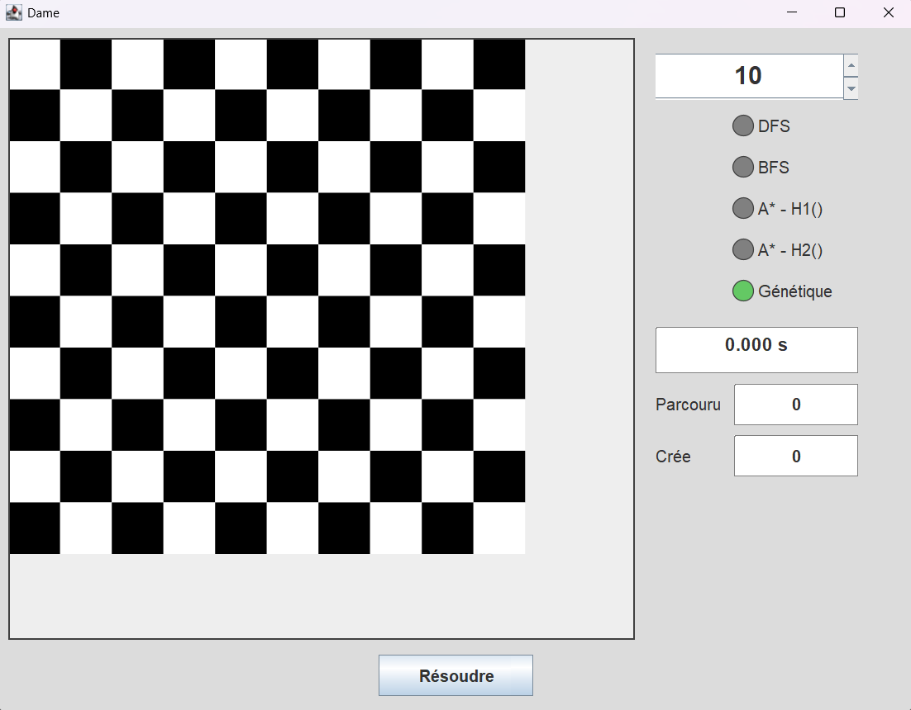

# N-Queens Solver 👑

A solver for the **N-Queens problem**, implementing several **search and metaheuristic algorithms** with a **Swing-based graphical interface**.



---

## 📋 Description

This project provides an implementation of the N-Queens problem using multiple algorithms:

- **DFS** (Depth-First Search)  
- **BFS** (Breadth-First Search)  
- **A\*** with two different heuristics:  
  - **H1:** Conflict-based heuristic  
  - **H2:** Distance-based heuristic  
- **Genetic Algorithm (GA):**  
  A population-based metaheuristic inspired by natural selection, which evolves potential board configurations toward valid solutions.

---

## 🔧 Requirements

- **Java:** Version 25  

### Tested and Compatible Versions

| Java Version | Status       | Test Date    |
|--------------|---------------|--------------|
| Java 25      | ✅ Compatible | October 2025 |

---

## 🚀 Installation & Execution

### Method:

Clone the repository:

```bash
git clone https://github.com/NabihSamy/Metaheuristic-N-Queens-Problem.git
cd Metaheuristic-N-Queens-Problem
```

Create the compilation directory:

```bash
mkdir -p bin
mkdir -p bin\ressources
```

Compile all files:

```bash
javac -d bin -encoding UTF-8 src/model/*.java src/algorithm/*.java src/algorithm/heuristic/*.java src/control/*.java src/view/*.java src/Main.java
```

Copy resources:

```bash
xcopy ressources bin\ressources /E /I /Y
```

Run the program:

```bash
java -cp bin src.Main
```

---

## 📁 Project Structure

```
nqueens-solver/
├── src/
│   ├── algorithm/
│   │   ├── SearchAlgorithm.java        # Common interface
│   │   ├── DepthFirstSearch.java       # DFS algorithm
│   │   ├── BreadthFirstSearch.java     # BFS algorithm
│   │   ├── AStarSearch.java            # A* algorithm
│   │   ├── GeneticAlgorithm.java       # Genetic Algorithm
│   │   └── heuristic/
│   │       ├── Heuristic.java          # Heuristic interface
│   │       ├── ConflictHeuristic.java  # H1: Conflict-based
│   │       └── DistanceHeuristic.java  # H2: Distance-based
│   ├── model/
│   │   ├── Board.java                  # Board state
│   │   ├── SearchNode.java             # Search node
│   │   └── SearchResult.java           # Search result
│   ├── control/
│   │   └── SolverController.java       # MVC controller
│   ├── view/
│   │   └── QueensGUI.java              # Graphical interface
│   ├── ressources/
│   │   └── crown-gold.png              # Queen icon
│   └── Main.java                       # Entry point
├── .gitignore
├── .java-version
└── README.md
```

---

## 🎮 Usage

1. **Launch the application**
2. **Choose the board size** (4–20)
3. **Select an algorithm:**
   - DFS: Depth-First Search  
   - BFS: Breadth-First Search  
   - A* – H1: A* with conflict heuristic  
   - A* – H2: A* with distance heuristic  
   - Genetic Algorithm: Evolutionary search using selection, crossover, and mutation
4. **Click “Solve”**
5. **Observe the results:**
   - Visual board solution  
   - Execution time  
   - Number of visited or generated states  
   - Algorithm-specific performance metrics  

---

## 📊 Algorithm Comparison

| **Algorithm** | **Type** | **Time Complexity** | **Space Complexity** | **Complete** |
|----------------|-----------|---------------------|----------------------|---------------|
| **DFS**        | Search-based | O(b^m)              | O(bm)                | ✅ |
| **BFS**        | Search-based | O(b^d)              | O(b^d)               | ✅ |
| **A\*** (H1)  | Heuristic | O(b^d)              | O(b^d)               | ✅ |
| **A\*** (H2)  | Heuristic | O(b^d)              | O(b^d)               | ✅ |
| **Genetic Algorithm** | Metaheuristic | O(g × p) | O(p) | ❌ (stochastic) |

### Notes
- **b** → branching factor  
- **m** → maximum search depth  
- **d** → depth of a valid solution  
- **g** → number of generations (for GA)  
- **p** → population size  
- **DFS** is generally **faster and more memory-efficient** than BFS for N-Queens.  
- **A\*** heuristics guide the search toward conflict-free states.  
- **GA** provides **near-optimal solutions** for large N, trading exactness for scalability and speed.

---

### 🧠 Performance Summary

For the **N-Queens problem**:
- **DFS** is the most practical uninformed search method, efficient for small boards.  
- **BFS** is complete but **impractical for large N** due to exponential memory usage.  
- **A\*** (with **H1** or **H2**) offers a **deterministic and efficient** solution approach.  
- **Genetic Algorithm** provides near-valid solutions for large N, trading exactness for scalability and speed. It can perform very well in some runs, but may also get stuck in local optima due to its stochastic nature..  
- **H1 (Conflict Heuristic)** typically outperforms **H2**, as it more directly penalizes queen conflicts.  

---


## 👤 Author

**Nabih Samy ABDELHADI**  
- GitHub: [@NabihSamy](https://github.com/NabihSamy)  
- LinkedIn: [ABDELHADI Nabih Samy](https://www.linkedin.com/in/nabih-samy-abdelhadi-31538a243/)

---

### Implemented Heuristics

**H1 (ConflictHeuristic):**  
Counts the number of conflicts among already placed queens and adds the number of remaining queens to be placed.  

**H2 (DistanceHeuristic):**  
Calculates the remaining distance to place all queens while accounting for existing conflicts.  

---

### Optimizations

- Efficient data structures (e.g., `HashSet` to avoid duplicate states)  
- Non-blocking GUI with `SwingWorker`  
- Dynamic chessboard size adjustment  
- Genetic algorithm parameters customizable (population size, mutation rate, selection method)

---

⭐ **Don’t forget to star this project if you found it useful!**
